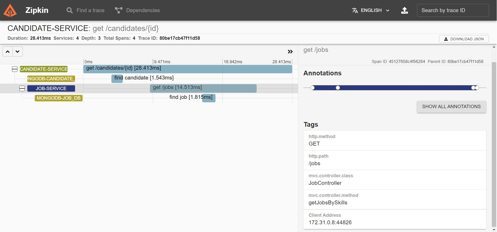
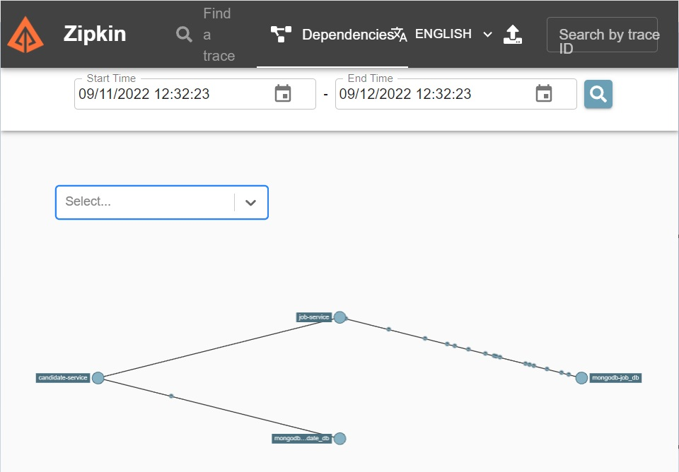
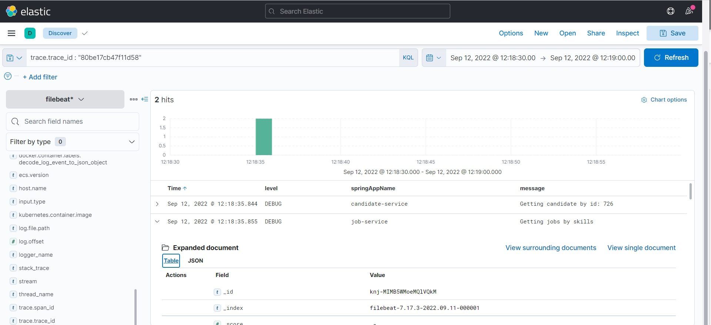
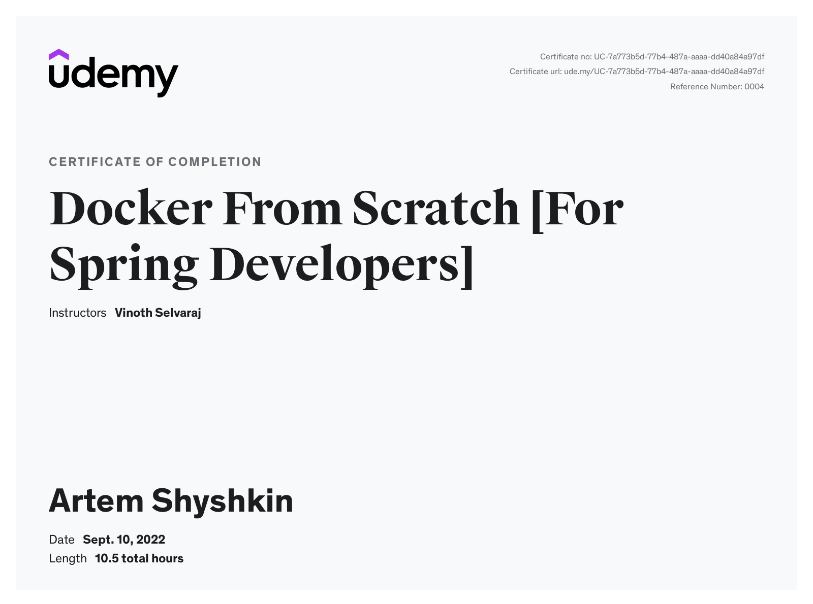

![Spring Boot version][springver]

![Docker][docker]
![Testcontainers version][testcontainersver]
![MongoDB Container][mongo-container-ver]
![Elasticsearch Container][elasticsearch-container-ver]
![Kibana][kibana]

![Project licence][licence]

# art-vinsguru-spring-docker
Tutorial - Docker From Scratch [For Spring Developers] - from Vinoth Selvaraj (Udemy)

### Documentation

1. [Docker commands](docs/docker-commands.pdf)
2. [Linux commands cheat sheet](docs/linux-cheat-sheet.pdf)

---
### Section 4: Docker Crash Course

#### [37. Installing Java Manually in Ubuntu Container](/Section_4_Docker_Crash_Course/37_InstallingJavaManuallyInUbuntuContainer/installing_Java_manually_instruction.md)

---
### Section 6: Dockerizing Spring Application

#### 76. Docker Compose Build Option

- `docker-compose build`
- **OR**
- `docker-compose up --build -d`

#### 77. Docker Compose Profile

To start only certain service we have several opportunities 
1. Use command argument
   - `docker-compose up mongo -d` - starts only mongo service
2. Use profiles
   - `docker-compose up -d` - only mongo_stack starts
   - `docker-compose --profile=app up -d` - additionally starts services with profile app

#### 78. Multi Stage Dockerfile

1. Command line:
   - _art-vinsguru-spring-docker\job-service>_ `docker build -t artarkatesoft/art-vinsguru-job-service:multistage -f ./Dockerfile-multistage ./../`

2. Docker-compose:
   - _art-vinsguru-spring-docker\docker-compose\art-vinsguru-docker>_ `docker-compose --profile=multistage-build build`

#### 79. Build Pack

- `mvn spring-boot:build-image`

---
### 8 Consolidated Logging with ELK Stack

#### 8.2 Running elastic search with docker

1. Start full stack with elastic cluster
   - `docker-compose --profile=app --profile=logging-elk up`
2. In case of error in Windows
   - `max virtual memory areas vm.max_map_count [65530] is too low, increase to at least [262144]`
   - use commands for Windows
   - `wsl -d docker-desktop`
   - `sysctl -w vm.max_map_count=262144`
   - or permanently add `vm.max_map_count = 262144` to __/etc/sysctl.conf__

####  8.6. View Logs in Kibana

1. Start full stack with elastic cluster
   - `docker-compose --profile=app --profile=logging-elk up -d`
2.  View `filebeat` logs
   -  Exiting: error loading config file: config file ("filebeat.yml") can only be writable by the owner but the permissions are "-rwxrwxrwx" (to fix the permissions use: 'chmod go-w /usr/share/filebeat/filebeat.yml')
   -  in Windows we can disable the permission checking by adding:
      -  `command: filebeat -e -strict.perms=false`
3.  View logs
   -  localhost: 5601
   -  Kibana -> Discover ->
   -  Create index pattern
      -  Your index pattern matches 2 sources.
      -  Index pattern name: `filebeat*`
      -  Next step
   -  Select a primary time field for use with the global time filter.
      -  `@timestamp`
      -  Create index pattern
   -  Kibana -> Discover
---
### 11 Distributed Tracing with Zipkin

#### 11.5 View trace and dependencies in Zipkin

- Find a trace

- View dependencies (_other microservices_)

- Find logs of a request by **trace_id** in Kibana

#### 11.6 Persisting Zipkin data into Elasticsearch

1. Add index pattern into Kibana
   - Menu &rarr; Management &rarr; Stack Management &rarr; 
   - Index Patterns &rarr; Create index pattern &rarr; `zipkin*`
2. Discover zipkin data
   - Discover &rarr; Change index pattern &rarr; `zipkin*`
   - by `traceId` 
     - i.e. `traceId : "13eb59a6cfc10547"` (choose one)

---

### _Certificate of Completion_

[docker]: https://img.shields.io/static/v1?label=&message=Docker&labelColor=white&color=white&logo=docker
[licence]: https://img.shields.io/github/license/artshishkin/art-vinsguru-spring-docker.svg
[springver]: https://img.shields.io/badge/dynamic/xml?label=Spring%20Boot&query=%2F%2A%5Blocal-name%28%29%3D%27project%27%5D%2F%2A%5Blocal-name%28%29%3D%27parent%27%5D%2F%2A%5Blocal-name%28%29%3D%27version%27%5D&url=https%3A%2F%2Fraw.githubusercontent.com%2Fartshishkin%2Fart-vinsguru-spring-docker%2Fmain%2Fpom.xml&logo=Spring&labelColor=white&color=grey
[testcontainersver]: https://img.shields.io/badge/dynamic/xml?label=Testcontainers&query=%2F%2A%5Blocal-name%28%29%3D%27project%27%5D%2F%2A%5Blocal-name%28%29%3D%27properties%27%5D%2F%2A%5Blocal-name%28%29%3D%27testcontainers.version%27%5D&url=https%3A%2F%2Fraw.githubusercontent.com%2Fartshishkin%2Fart-vinsguru-spring-docker%2Fmain%2Fpom.xml&logo=data:image/png;base64,iVBORw0KGgoAAAANSUhEUgAAAB4AAAAjCAIAAAAMti2GAAAAAXNSR0IArs4c6QAAAARnQU1BAACxjwv8YQUAAAAJcEhZcwAAEnQAABJ0Ad5mH3gAAAPCSURBVEhL7ZZNbBRlGMffj9nZabddtqW1yldDoSUSP1ICaoKlUJtw0BDTNCQcOBDjxSOnxpvGaLhw9KYSLxxAOGDCQa1iNBFogYCBdLds60KXfmw3W9idz/fDZ3bGsl1md6cYb/4Om5ln3uf/Pvt/n3nfwVJKFI6fHmXh952XNnm3DQklnbeso1fGby3n4Pq19o7zB4fao1HvUR0aS5+8fvWr5NQLmhYlBG4tIRZN84O+Xaf3vekNqEU96a9TybHJ682UxhQFY+xHEYKUEmM656f27juxs8+PPkOw9GQud/y3KwXLTKhRUiFaiZCyYFvtUe3bgcE9Gzv8aAXV0kXHOfbrL78vzIMDStmB+rCyP/u7Xjx74GBLJOJHy6yR/vjGxJf37nZomkapHwqHyXnOND96effne/b6oVXpszPpk9f+UAluUSKVtoYHdIrMsYU8/cZbx7b3QATPrKyMjP+YNQ3op1q2hgcWADp1U6z5wtAwzXx49Gbx8RYbI4yh/ucr2QPSCUbxaCSzbKfmS6QV00Jn83Rvm90UiTAJf8wfuG6kQhFz8ExG5PMypkbKPSAkRyi9pSXTHUeEECbWOYGEVsISZ+flbJZzKQmFf4/89gIXFC71KJ3q2bDUFaMCYR5mAgkuKgRDmdMZrpsCCl+19GnnQoBId4J8XE32thUTGly76xI0ARhXdgDrJZz6i+efCGhXAm1QsVTVLwU8oZAl5Fxnc7onwTTFnaBa3a1UMDz7UGRzHNToWlGP4PcNRilC2gTf39Y6tzUOacT3p2wrwguLMj3HGXcLf1bUI1jaA54pTBY1OrUzke+MwWQgVCi4tj4x1tgaSD1pAFJhASiTSwk1tXtjOsVyK4KSalsDaSDtARqUI0GQ4DLQ1kBCSftIt1vDsx7pdfK/dBXQWv8JsD0QXXDEGWwVfuxfA1LCcnTGyfkd/Z9s3mXZpsFZ4E4UHvcMc5he1D870H/uvYGnx+6R6clLy1kSgXMsaAFgj2oiyveLqCn4RLY4d4rG+6/0XDwy6EXWnOizlj6YvJYxS6qiwrbjRz1qS3MhDcPsbt/w8+jQ9kSrH62S9vgu/2g0fQsuNFrx0RQkDbkly4ED8dy7+0f7uv3oPwRIe4w9nDqVTSJF1bC7a1RJQxYslDSssbdf/2Kg30upoqY0AF9Gh6cnxgsLVImqmKxK21zYJWO4d+vlkUN1vrDqSXvc0R8PpyYWbUNt1ZRLSzpyuuKxH0YOvdrZ5o+oBUiH4ZulB+j2ZfTpmTN/3vdDjWhc9XOC0N95QCMLG07m0AAAAABJRU5ErkJggg==&labelColor=white&color=grey
[mongo-container-ver]: https://img.shields.io/badge/dynamic/yaml?label=MongoDB&query=$.MONGO_VERSION&url=https%3A%2F%2Fraw.githubusercontent.com%2Fartshishkin%2Fart-vinsguru-spring-docker%2Fmain%2Fdocker-compose%2Fart-vinsguru-docker%2Fenv-versions.yaml&logoWidth=40&logo=data:image/png;base64,iVBORw0KGgoAAAANSUhEUgAAAEoAAAAjCAYAAAAzK5zjAAAAAXNSR0IArs4c6QAAAARnQU1BAACxjwv8YQUAAAAJcEhZcwAAEnQAABJ0Ad5mH3gAAAjTSURBVGhD1ZkJbFzVFYb/N4tn8yy24zWO7QjbISDigNOkgZAQnJgQ3JDgpqAIKC1SChJpkQpSVVEq2qpFqoRQCyGoLiqUWLgpkdJglCpxmrJ0oVCFtNAQUkLI1sTrePbtTc+573o8M54Zj7EdD5995bn/vHl+77/nnHvvGyVOIAdqXIVO0cleYfDP/ihae4ZhtWjXFYrFcXWJHu9vLRH92WBSB+448Jh8VWDQ8Kqy8UjnHu7pk9Oo5v33Yt8HffAGvFIpLBRFa5eDrEZV7dmMU75+FDvLUbvrTqkWBirHEKVbIKo1lV6HVfnmLJHRqCv33YPBaAg2gxlGg4EuQkXFM5vlu3OP3aigtdaIdTVaW0NtZYVBvjs7TCjmD/7tKew62QuXyYE4hbWOsk5xq/BGg1hctgBH7+uSR84cHBVvnAvDpNfyiIPDrAeWVxrRdyZCupBFPbIYFKysMuDoQBQm3fjxRhry5pLZMyvFqPcGjmPZ/m/Caaug3FdSjOJiMBQYwROrvoHHb/i6/MTMcGIohkVdA4BVBjj9O5dDh+NbXajaSbqc3VivKNHhH5tdqN+VpFPqLSgz4LO7S7X+LJCSehsOfw82a5kwaQIklVic+OGfn8eQ3y3FmYGjgW/aIpvBoqDUpEMRR4x5XNebpc6Rl6TrqLmKMlxzFng50f7a1O4hYVTv6bcxEByii04L3yQr2UCz2YF7en8mlS8m6/a7cfCTMGwcxXmSsOHRY12wFDlkLztWoxmv/6cPnpBPKtOHShQQVBGQLRqMY4SmsQgXpdC4Hgtl1lU63h1OVJCcnPfG8NanYZitCvwxmhh+PSjfyY2oUYPBEczr2QSnpTQl7USN8tNBw1QcZOFkPOEAHlragafadkhleoTIqT+dj8CSKOZxUaivp6J9gIp5QqdyysX8SzTDHToboYKfqn+5yij6ufjBOz785F0/LJTCDBv9wDUWPLe6WPSzIYx65vhe7HhvJ+W5XcoawigKHGUk1aioGqOVsIrRh3ulkh/9gRhu/6MHJfIiY3SDJTTVv3SzHRsPjIr6w3ERo4gppxr08xVWdB7Sjh/Tq6ng/3iZFXf1eWhm1vQo6U0OPR6+xoyth7xwynrFkddo12Nnkglr/+DGkQtkPhnLsMkhHw3NdypEPxvCqPUHH8Wbgx/SyBVJWSObUXH6GfYO48T2l9FUVifVyTnjiaGui0I9MbvFyRwFZ+8ug/XZ/hS9hm7w/TucKH8+6Xgqwg20p3trkxO1vyKdiviYvqTcgL232NH4wlCKfhXNhh/cOb4HbHplGJ+MxhJLEYajqrvdjvpiPYYphWvo/11L50tGnPGY+xSMilys5IFCPzpDEXo+OiKV/BBe00jyaHIzyL+ZdE4rPZeBJF2frNPfMV2X0FPPo1AbW4ONYaf7T69mForebQc9uOHVEXRQob+OzFSevoSWPcNUZihICGHUpcAg/RM5CnlSZDDinXMfyl5+iAukUOdw15oIHo10XcStRkKXr+k3Vac+a0KnNqYntCS4vsWpiKfDNWtsuWGhiDIX63CMFrUte0bE+zpfJEAhGsy8dsqBgSLwxOgF2csPygQqHFS8I1QXqKnUglTII+xAmh6ivpjdpMYtTmkRivKERzq/plmQG7/20/vaecaP59d8/mQeWWKV02xuhB903t9S/RT9c6MX4/P3dsJlnSeEZLLNekyECnqJyYLTD/xOKl8MDp8No/31URgogXQ5goPr1o3zjXiDdgGMcsbzv/iCV7+a3SgKOGUoi1FmK05/q0cqmeEV8L+HY1w65gwuKiMUXW4P3QfVLBNNIMkmjcUXp2uY05JMur6uCG9v0UxilNGQN+7oXg+XrVJK4wijgnTQYAajYlGUWR04tb1bKpkp/80gBimE0z5+2WGzuNinlxiuYUFatoANIgPX1hbh8essuGl+6gpALA+Ul26C0+yaeBLqZjMqGA1jRWUzDm97WiqZsbxA2wSVZqDUjxcEdOsI0hrK92A5rJPsFcVUt9CxgOpehqkgBxE1itbqRbKXHRcN4/j8VVgE6ZZvrDdNahIjjLq1upV21DTNTIFIOIgNC5fLXnaqbHpttiswOJoQULG7LffWZQxh1I7mzYhF/dqH06GsS4eLHnQ6tDW0SiU7i1062mLITgERpGXGxmYTFtAOIB+EUVeWNKDenn/6BaMhdDavlr3crKykjWqBhZQYaJpgejc6pTI5wijmxRWPwE8r9AlkiIagdxC/WPdt2cvNloU0e/Dir4C84k1wz8bJHyklkzBqTc21WF7ZAj9FSzKqmuqUNxzAbYvbaNM6cd2ViVraaNqoRTKl9RwQCKnY1GzG1xpNUsmPhFHMX295FuGIjzJFM4dnq1LFKvZdTIxMC5ORr219UvTz5YllFkQp1OeaAEV2vUOPfbdOLZqYFKN0VKDfbP8lPL6LorBHqWYtstbQX7KK+m7PRRy5K/e6KRPfbaH9FcHPn+YKNmmeWcGnn/MLiBSjmFVVS7B79Y/g9p6HP+bHWvvV8MVCGHZfQFfHY1hTv1QeOTV+v8GBMNWGyw0PMO/bGhw69N9XJtWpM8EoZtsV7eheS+nlH8VtZSugp5Tb3flT3L/0K/KIqdN5hQnt1LhGXC44goNeFZ1Uj05tm95XWSnf66Xzcf9pHP/Xf9HS2Iy6ulqpTo+m7iGcHIklnlnPBnxLQZ5pabWzv8OBjoapFe5M5LzaptI62k1HYLPbpDJ9PqaRXVltRIDSUKxnZhA+X4AmjaBHxb2LzIg/VD4jJjG5h5X2abyZtdtmzijmL1tceI62DqEA3RilIn858HkR5kSp0XaEz3f/YhNCO8rxonzgNlPkTD1mX99B3N62XvZmnu//3YcnjwYQ59rFD63ks289DaE2irxh1R73cnUT2yG+YhZoG8LPl9rqirD9KlobUQ2cLSY16kL/JVSX5/4qZyY4ORJF72cRvNsfxUfuGC75VQxQGnHE8FfrZSZFfD3VUKxDo1OPJaV6rKIUrs9zrzY9gP8D99XqfazGxYwAAAAASUVORK5CYII=&labelColor=white&color=grey
[elasticsearch-container-ver]: https://img.shields.io/badge/dynamic/yaml?label=Elasticsearch&query=$.ELASTIC_VERSION&url=https%3A%2F%2Fraw.githubusercontent.com%2Fartshishkin%2Fart-vinsguru-spring-docker%2Fmain%2Fdocker-compose%2Fart-vinsguru-docker%2Fenv-versions.yaml&logoWidth=40&logo=data:image/png;base64,iVBORw0KGgoAAAANSUhEUgAAAFYAAAAkCAYAAAATvM09AAAABGdBTUEAALGPC/xhBQAAAAlwSFlzAAASdAAAEnQB3mYfeAAABBNJREFUaEPlmU1IFGEYx9/xc2sLtzzkFuZXRHgIO9TBCN0gr56CFKK8dOoWRR07ZFEkEV2CyMJS+oAw6GKQ7tlDEiRSmCtWElG5kOWmNr3Pu8/I7HzsvM/MzuyEPxjnfR6dZf2/z/t/P0ZROcwDi2/OsOUvfRhl2dyaYqXROozWJ2RhVxdn2c/xVoycUZc/s9gRT33nmaHxNOuenMAoSz2/Zk60ZQMfKMG7FOmxHSRRAaV8u3hu4aWCmfWBlLCTd2NsaqAZI3doAq8XHIUFQUu4KMD8XJW4ewHELYrAKbwHRF6PtavSeG0aW+4J1HtX0izxkHssGCsCzf42/zzWVlinoV9scWFCMtK1vypvvmsfJjTKvI9AOyyFlfHTQggLlG09xqJ7r2MkCa9A5ZK5AmGWVy4mSXm/MHms7CRVCL+tav9EF1VDJ1IO1LwkiSTvGAKk5ZaR71+j2KIDov4vJO4n2Rif/BR+lyXHClYzC9jyh9LKGLY8ErAVGJ9VJZ4j77zCgpvJywjknYDnjLu2k1xkpxVF6IWFYWisNPinwPN0aQEl37GxRQhr9E7t8zXg92ADRpyqdk3YnTVxkaBSyYfl3M23GJnJrGb7TT3eKO5UqEO7UHmNBt6xVnuLweYWbGUxVv/a5FURibi61E3b8BOsqSxVxBUZnMEMEd0/nYPH/Fpol0fsPg7sQX9BB0EnaAhhp2eC2e+5FreI1Nspa4T/HaioiSuE3dXYIIIgIItr1+ce8yLkNmaZ19F/MHfIO9GLFiE8NqooLF4n2zVmPva+wpYcS93BdaRXrFYFdrTzaxT9OXTCwiycsqu6AKF+Bb2ogBBW4cI2hURYu1k4dMCX5JK18+sULt30CGHPnjvPnj1+hCk6FGFTnbWsJlqGkRnKtrFYyOy8xOR17eoVEfhNJvM3r6iA+3ETDDDkZfB0CENF7WnClj2hFpYPf72P5kNYAbZDQQ+fvO6F1GTBT0cdzgg0Aq1YGWAPH1ZkRQVCJ6zMiVMxMJ4NOJFjBT+WfrPqB7cxkuNQE22xP7/8h73rOIqRNWFbGVAsQCOnYrdENmDLP+LlFaxtdJi9mJvGjBlqdfgJTKZUUQHT5EWpWmq1WpFMdGIrlzBULYiqP0KkYPJYqFqVi+tEIUTNR7Gr1ouogOXkpZ6+ICWuV+yqFYBJDLwtcPhSD169eBEVyLuOVW5dZoqF7/ppAUaCPjuAkVKIlYnjBmFq4RtrfjqAkXdRZVYFRsTrZ2z7AlQp36s6vSCkIL3zKrlzw7OoslVqBeVclILMG1c3SAsLDM++Z30fJjGSx02V2lEIge2O+goJSVg9u0eeiDWpHSDm8wOH2Z5YNWYKzEqaDb1mbOTXhDgYBx/WezHMe+LiP7RtcnC7Osb+AQgSzKe9xJg9AAAAAElFTkSuQmCC&labelColor=white&color=grey
[kibana]: https://img.shields.io/static/v1?label=&message=Kibana&labelColor=white&color=white&logo=data:image/png;base64,iVBORw0KGgoAAAANSUhEUgAAABsAAAAkCAIAAAD3mtZ6AAAAAXNSR0IArs4c6QAAAARnQU1BAACxjwv8YQUAAAAJcEhZcwAAEnQAABJ0Ad5mH3gAAAUMSURBVEhLpZZrTJtVGMdfPwwExq3Q0vLCFhO/bMZMiXNCzKbjVlhDB/RlOKIf9JvRuLjED+pYHCRaKDPQQrtRmaVAaYCWspZCuWRxX8ZCsqgTnLiYcBm0HVAuA9r14nPO+xYoFOzw6T8np2/P+fV5zv85TYn15dXVh5Nrj2ZAzx5N4wmMtJgn/ud+/Rn4lv50fHppdMLjchNLv4zPZXxjzbk2h1ThH2nhefbmc0bWrbfMBLbPvvP1bIXW4/MRy/f+suVde1pS8z9UbSsQP/n0ptfn83g9NLFi16KQZIeRqrEVVk2er3T5fG5E9NLEyh1LQ5QdcJRkMrN8fdYBCXq9MDBVH5gomT5b7rgzDtkhGI6DVw24Wf53trp+zNkEHphISewFP8x8rkTFMigmENH6QkQKjbaiqumianBjd7xgjggngQRnwA37EsMIDES0gzOwFH/5f4iS2EpqZt+/snh3DJo5aNBVV9pLJCDYsC9agtolt8J6YwDODloPd8vOINZG/l4VVK2USpdK6+Yv1C4wRAkWPdn8juo5gXjmUhP0Cuq9oDwgTtwZrT5RrDr9iTHni4fCqytlUu9HCtfF+pXS2nmaDrai9GvsheKpomp0MZheDh6E0WQiXiJiEllRCXGHWDExcdFp5Kufncjpy/1y/UOF86Ji4cJ1aD2bSDKdWb72dJXZt3cQ/b3mw+ERR7hkCo9M5ZEpXJLHZbM4rKj4WHZC4qU3+Y8psaeswZZ5ZXFkAja490kPh5/IIwEKSuUlAxdPSJLLi2cnhsceLktJm2q0wGpUrzt0Ii3MpSdAP8olSVYi+/Xj6Z1yxYN7eAsyZudF2RZA7AsgbikZxlQ2h8vhnuv6Ka9VnqGsKWpXLrnQTYHfQXr/7tiLiGtPSmZHxmTdFOdrlHkt9Xx1fZaq9lSj5IFtDm1FaQZJdVfVWFAvVJ0UHpH+7WVBVxO/pT6vpQHEb5blNkvfu60Zsk7B5uAdHjTHVHA8KuZYibCgpw1lB0R1A18t46vqRQPdosHuMz1tA9YnCODFr20R3JkUVtwraW+c71XzmyE1lCCUnPuzrNCkpYZ6RAN60ZDujEEztryAGIGpBhJx06SykzhccOMWX63Ax4egubekQoOKGkY4arBbZOkutuiyTdpnHmw9nSuObUSMO5LESYyMzlJe97uBj08lE2iV1JCRGkQ4LDQR9nd+fLcPKM89qFMDibj7YOS8HJFeflnQ0ZTXLN+sN79VTg0b6Oy2C55kGzWt/zymWXRsEpNJeEVGv/ZBcUF3M3aWwfFVUpFFD8dH7SKCAJpp1Kx5mdohtnIk4xOOnnxLaAScHEB+N6SFvR174bD0ArPu+9/uAwv/InkxMSyKTEoApkDXBHcD4xARudGtLhneB4dUbNGfNWgc7g1kj8+DiFFhYUkRsciNtkbMwt2nkgq0TdTwdjeCSk8NGM6ZO6Vjv0Ka6H9Pv8l8iCDSr34Fd4M5O7AYtaEct96O/UGlLx7Q5/d14GP0EGZtZ3J+ptCgZi4GeLLpBjr4HZv3kj7b1D66YAckYRq9f1otwz4gHHajrsjcTg0acL2hSmDuEv8+goiWyYl3lT8yxwd3QwVutFKDt4stkCD0YChCK4v6ddSgERENE38cl1Weaqx++0bNSYUko1mWZe7KMrdnmTSZoQlW4sVtabqmFbeHcHo88xvrDqfT4dpAeu5cdLkcWDAJRf7FG3bnhtvt/hdT3ivk4y+EQAAAAABJRU5ErkJggg==
